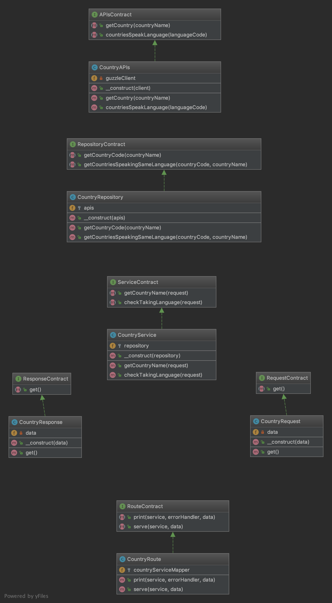

# YAS.Life challenge

A command-line utility that list all the countries which speaks the same language and checks if given two countries speak the same language by using open rest api.

- [Description](#description)
- [Installation](#installation)
- [How to use](#how-to-use)
- [Code Digram](#code-diagram)
- [Tests](#tests)

## Description

##### The company handles their Sales payroll in the following way:

- When you enter one country the tool will return the country language code and other countries that speak it.
- When you enter two countries the tool will check if the two countries speak the with the same language or not.

## Code Diagram



## Installation
Download or clone the tool files and go to the main app root.

```php
cd [path_to_app]/
```

Install dependencies.
```bash
composer install
```

## How to Use
From your command line run the following command:

#### To get country code and other countries that speak the same languages

```bash
php index.php [Country name]
```
###### Parameters
| Parameter  | Required | Default | Example |
| :---        | :---: | :-------- | --- |
| Country name  | Yes  | None | Spain |

##### To check if two countries speak the same languages or not.

```bash
php index.php [First country name] [Second country name]
```

##### Parameters
| Parameter  | Required | Default | Example |
| :---        | :---: | :-------- | --- |
| First country name  | Yes  | None | Spain |
| Second country name  | Yes  | None | Egypt |


## Tests
```bash 
php ./vender/bin/phpunit
```